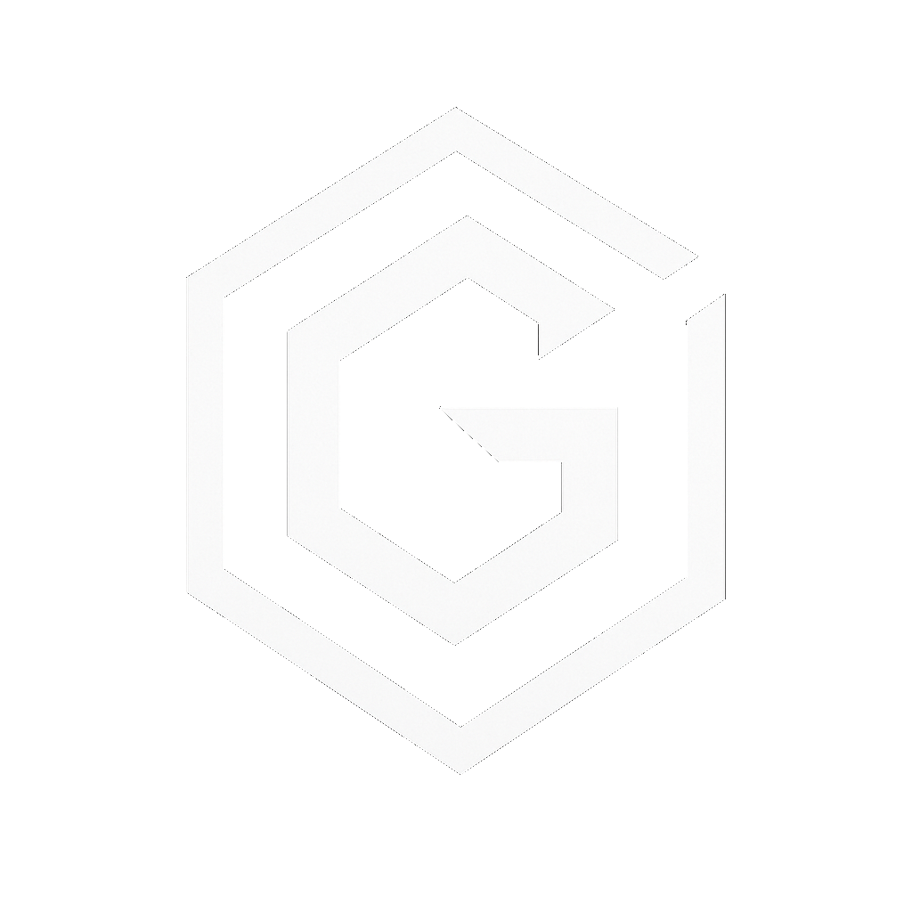

  

  
  &nbsp;
  
  &nbsp;
  

  <em>I architect high-impact digital ecosystems — from AI-driven platforms to enterprise cloud infrastructure — turning complexity into competitive advantage through strategic innovation and execution mastery.</em>

---

<h3 align="center">🧠 Core Expertise</h3>

  <code>Digital Transformation</code> · <code>AI Strategy & Implementation</code> · <code>Cloud Architecture</code> 
  <code>Enterprise Modernization</code> · <code>Automation & Optimization</code> · <code>Technology Leadership</code> 
  <code>Cybersecurity & Risk</code> · <code>Full-Stack Development</code> · <code>Venture Strategy</code>

---

<h3 align="center">⚡ Tech Stack</h3>

<h4 align="center">Programming Languages</h4>

  
  
  
  
  
  
  
  
  
  
  

<h4 align="center">AI, Machine Learning & Data Science</h4>

  
  
  
  
  
  
  
  
  
  
  
  

<h4 align="center">Frontend & UI</h4>

  
  
  
  
  
  
  
  
  
  
  
  

<h4 align="center">Backend & Runtime</h4>

  
  
  
  
  
  
  
  
  
  

<h4 align="center">Build Tools & Bundlers</h4>

  
  
  
  
  
  
  

<h4 align="center">Databases & Storage</h4>

  
  
  
  
  
  
  
  
  
  

<h4 align="center">Cloud & Hosting</h4>

  
  
  
  
  
  
  
  
  

<h4 align="center">Infrastructure & DevOps</h4>

  
  
  
  
  
  
  
  
  
  

<h4 align="center">Monitoring & Observability</h4>

  
  
  
  
  

<h4 align="center">APIs, Auth & Integration</h4>

  
  
  
  
  
  
  
  
  
  

<h4 align="center">Blockchain & Web3</h4>

  
  
  

<h4 align="center">IoT & Hardware</h4>

  
  
  
  
  

---

<h3 align="center">📊 GitHub Analytics</h3>

 

  

  

---

  

 

  <a href="https://guglielmo.io"><b>guglielmo.io</b></a> — Transforming vision into digital reality.

